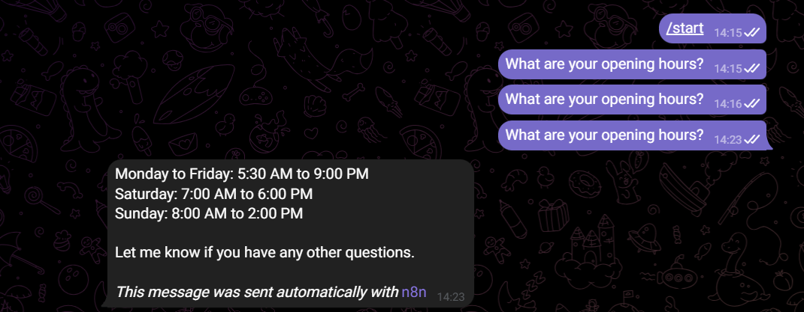

# n8n AI Customer Support Agent

An AI-powered Telegram customer support agent built with n8n, Google Gemini, conversation memory, human escalation, and Google Sheets logging.

## Features

- Answers customer questions through Telegram
- Uses Google Gemini
- Remembers the conversation
- Detects when human support is needed
- Alerts the support team
- Logs conversations in Google Sheets

## Tech Stack

- n8n
- Google Gemini
- Telegram
- Google Sheets

## Project Status

## Screenshots

### Complete Workflow

### Normal Customer Response

Day 1 of my 12 Days of AI Agents challenge.
